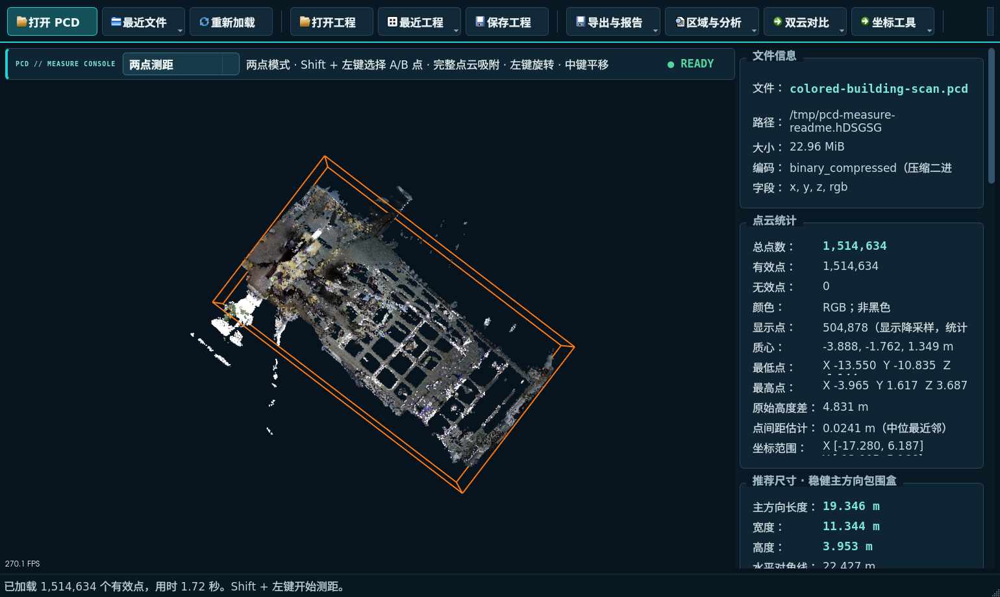
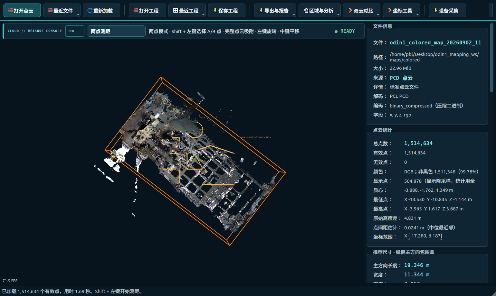
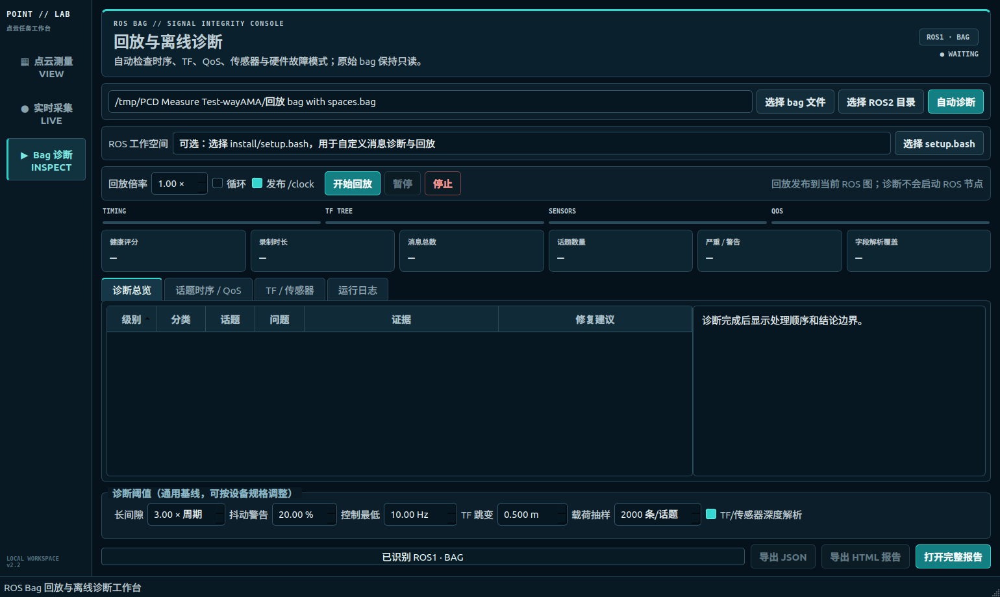

# PCD 点云测量工具

一款面向 Ubuntu 的桌面点云工作台，用于查看、测量、裁剪、分析和对比 PCD 点云，也可以回放并离线诊断 ROS1/ROS2 bag。



> 截图由程序直接加载 1,514,634 点的彩色建筑点云生成。测试点云和用户数据不会放入仓库。

| 项目 | 说明 |
| --- | --- |
| 当前版本 | 2.0.0 |
| 已验证系统 | Ubuntu 22.04.5 LTS x86_64 |
| 核心依赖 | Qt 5、PCL、VTK、CMake |
| 点云输入 | PCD：ASCII、binary、binary_compressed |
| ROS 数据 | ROS1 `.bag`；ROS2 SQLite、压缩 SQLite、MCAP |
| 数据安全 | 本地处理；源 PCD 和原始 bag 始终只读 |

## 目录

- [关于](#关于)
- [主要能力](#主要能力)
- [下载安装](#下载安装)
- [五分钟入门指南](#五分钟入门指南)
- [界面说明](#界面说明)
- [PCD 加载与查看](#pcd-加载与查看)
- [统计与整体尺寸](#统计与整体尺寸)
- [鼠标测量](#鼠标测量)
- [选区、裁剪与局部分析](#选区裁剪与局部分析)
- [双点云配准与差异](#双点云配准与差异)
- [坐标工具](#坐标工具)
- [工程、恢复与导出](#工程恢复与导出)
- [ROS Bag 回放与离线诊断](#ros-bag-回放与离线诊断)
- [快捷键和鼠标操作](#快捷键和鼠标操作)
- [命令行工具](#命令行工具)
- [精度、性能与数据安全](#精度性能与数据安全)
- [构建与测试](#构建与测试)
- [常见问题](#常见问题)

## 关于

PCD 点云测量工具把常见点云任务集中到一个中文桌面界面中：打开一份点云后，可以立即检查数据质量和场景尺寸，完成点、线、角度、面积、平面和圆的测量，再继续做局部分析、双时相对比、坐标变换、工程保存和报告输出。

它适合以下场景：

- 机器人、SLAM、激光雷达和三维扫描数据的快速检查。
- 房间、厂房、道路、墙面和设备点云的距离、面积与高差测量。
- 对局部平整度、高程分布、路线剖面和挖填体积做初步分析。
- 对两次扫描进行刚体配准，并定位变化区域。
- 在不启动 ROS 节点的情况下检查 bag 的时序、TF、QoS 和传感器异常。

点云功能不依赖 ROS。只有执行 ROS bag 回放时，电脑才必须安装对应的 ROS1 或 ROS2；离线诊断可在缺少 ROS 运行环境时完成基础索引分析，并在消息类型可用时执行字段级深度分析。

本工具强调现场核对、研发诊断和可复现报告，不替代经过检定的全站仪、测距仪或法定工程测量软件。

## 主要能力

| 能力 | 可以完成的工作 |
| --- | --- |
| 彩色点云查看 | 保留 RGB/RGBA；无颜色时自动按高度着色；支持标准视角、正交相机、网格和坐标轴 |
| 完整统计 | 点数、无效点、彩色比例、文件大小、字段、坐标范围、中心、高低点、点间距和高度差 |
| 稳健尺寸 | 同时给出原始坐标轴包围盒和抗少量离群点的主方向包围盒 |
| 八类测量 | 单点、两点、折线、角度、面积、正交分解、点到平面、三点圆/直径 |
| 记录管理 | 自动编号、名称、分组、备注、颜色、筛选、显隐、复制、编辑、撤销/重做和 JSON 导入 |
| 选区裁剪 | 鼠标 XY 框、精确 XYZ 框、高程范围、多边形套索和反选 |
| 局部分析 | 平面质量、密度、直方图、剖面、格网体积、统计离群点和 RANSAC 主平面 |
| 双云对比 | 直接比较或 ICP 配准、差异热力图、误差统计和对齐结果导出 |
| 坐标处理 | 显示原点偏移、平移、绕 Z 旋转、统一缩放、预览、撤销和矩阵导出 |
| 工程与报告 | 工程恢复、自动恢复、PNG、PCD、CSV、JSON、HTML 和 PDF 输出 |
| ROS Bag | ROS1/ROS2 回放；话题、时间戳、TF、QoS、传感器和硬件故障模式诊断 |

## 下载安装

### 1. 系统要求

当前发布流程已在 Ubuntu 22.04 x86_64 上完整验证。仓库提供源代码，目前没有预编译的 AppImage、`.deb` 或 Windows 安装包。

安装编译依赖：

```bash
sudo apt update
sudo apt install -y \
  git build-essential cmake \
  python3-venv python3-pip \
  qtbase5-dev \
  libpcl-dev \
  libvtk9-dev libvtk9-qt-dev
```

ROS 不是点云查看和测量的必需依赖。需要回放 bag 时，再安装与 bag 对应的 ROS1/ROS2、storage 插件和自定义消息包。

### 2. 从 GitHub 下载

推荐使用 Git，这样后续可以直接更新：

```bash
git clone https://github.com/asoming/pcd-measure.git
cd pcd-measure
```

也可以在 GitHub 页面点击 **Code → Download ZIP**。解压后进入项目文件夹，在空白处右键选择“在终端中打开”。

### 3. 一键编译并创建桌面图标

```bash
chmod +x build.sh run.sh install_desktop.sh scripts/*.sh
./install_desktop.sh
```

安装脚本会：

1. 以 Release 模式编译程序。
2. 在项目内创建可选的 `.rosbag-venv`，安装 ROS1、压缩 bag 和 MCAP 的离线解析依赖。
3. 在桌面和应用程序菜单中创建“PCD 点云测量工具”。

编译默认最多使用 2 个并行任务，避免 PCL/VTK 在内存较小的电脑上并行编译失败。需要手动增加时：

```bash
PCD_MEASURE_BUILD_JOBS=4 ./build.sh
```

如果暂时不需要 ROS bag 深度诊断，或安装时没有网络，可以跳过 Python 可选依赖：

```bash
PCD_MEASURE_SKIP_ROSBAG_SETUP=1 ./install_desktop.sh
```

以后需要时再执行：

```bash
./scripts/setup_rosbag_tools.sh
```

### 4. 第一次双击启动

安装完成后，双击桌面的“PCD 点云测量工具”。如果 Ubuntu 把图标显示为普通文本文件，请右键图标，选择“允许启动”或“信任并启动”，再双击一次。

桌面图标引用当前项目目录，因此安装后不要删除或移动项目文件夹。若移动了目录，请在新位置重新运行：

```bash
./install_desktop.sh
```

也可以从终端启动：

```bash
./run.sh
./run.sh /path/to/cloud.pcd
./run.sh /path/to/project.pcdmeasure
```

### 5. 更新已有安装

Git 下载方式：

```bash
cd /path/to/pcd-measure
git pull
./build.sh
./install_desktop.sh
```

ZIP 下载方式需要重新下载并解压；如果目录位置改变，应重新执行 `./install_desktop.sh`。

## 五分钟入门指南

### 第一步：打开点云

点击左上角“打开 PCD”，或者把 `.pcd` 文件直接拖入窗口。加载过程中会显示文件名、状态和进度；完成后状态变为 `READY`。

### 第二步：检查数据

先看右侧“文件信息”“点云统计”和“推荐主方向尺寸”：

- 确认有效点数是否符合预期。
- 确认 RGB/RGBA 是否存在，彩色点比例是否正常。
- 检查坐标范围、高低点和原始高度差是否有明显飞点。
- 使用推荐主方向尺寸了解场景主体的长、宽、高。

### 第三步：调整视图

- 左键拖动旋转。
- 中键拖动平移。
- 滚轮缩放。
- 使用俯视、正视、左视或等轴视图快速定位。
- 大点云操作卡顿时，降低“显示点上限”；统计和测量仍使用完整点云。

### 第四步：测量两个位置

1. 在视图上方选择“两点测距”。
2. 按住 `Shift`，左键选择 A 点。
3. 继续按住 `Shift`，左键选择 B 点。
4. 程序吸附到最近的真实点云点，并立即显示三维距离、水平距离、高差、坐标差、坡度和倾角。

### 第五步：保存结果

- 点击“保存工程”保存点云路径、测量、相机和分析状态。
- 点击“导出与报告”输出截图、CSV、JSON 或 PDF。
- 源 PCD 不会被覆盖；裁剪、清理和变换结果需要显式另存。

## 界面说明

主窗口采用深色测量台风格，信息按任务分区：

| 区域 | 用途 |
| --- | --- |
| 顶部工具栏 | 打开/保存、导出、区域分析、双云对比、坐标工具和 ROS Bag |
| 视图状态栏 | 选择测量模式、查看当前操作提示和运行状态 |
| 中央三维视图 | 查看点云、选点、测量、裁剪和差异热力图 |
| 右侧数据面板 | 文件信息、全局统计、尺寸、显示设置、局部统计和测量记录 |
| 底部状态栏 | 加载耗时、有效点数、操作提示和错误信息 |

界面支持最小 1100×700 窗口；推荐在 1440×900 或更高分辨率下使用。

## PCD 加载与查看

### 支持的点云

- 编码：ASCII、binary、binary_compressed。
- 必需坐标：`x`、`y`、`z`。
- 可选属性：`rgb`、`rgba`、`intensity`。
- 非有限坐标会计入“无效点”，但不会进入显示、尺寸和测量计算。

### 加载方式

- 点击“打开 PCD”。
- 把 PCD 拖入主窗口。
- 使用“最近文件”。
- 执行 `./run.sh /path/to/cloud.pcd`。

程序会保留 RGB/RGBA 颜色。没有颜色字段时自动切换为高度渐变，也可以随时选择：

- RGB 原始颜色。
- 高程渐变。
- 单色显示。

查看选项包括点大小、背景色、坐标轴、地面网格、稳健尺寸框、完整云上下文、文字标签、透视/正交相机、显示点上限和一键适应窗口。

默认最多显示 750,000 点。显示降采样只影响渲染，不影响总点数、统计、稳健尺寸、局部分析和最近真实点吸附。

## 统计与整体尺寸

加载完成后，程序会自动计算以下信息：

| 分组 | 数据 |
| --- | --- |
| 文件 | 文件名、路径、大小、编码、字段 |
| 点数 | PCD 头部总点数、有效点、无效点、彩色点数量及比例、当前显示点数 |
| 空间 | X/Y/Z 范围、质心、最低点、最高点、原始高度差 |
| 密度参考 | 全局估算点间距 |
| 原始包围盒 | 沿 X/Y/Z 的长度、宽度、高度和三维对角线 |
| 推荐包围盒 | 主方向长度、宽度、高度、水平/三维对角线、主方向角和离群点剔除比例 |

原始坐标轴包围盒使用全部有效点，便于发现边界和飞点，但容易被少量离群点拉大。推荐尺寸先估计水平主方向，再在投影方向两端各剔除 0.5%，更适合描述房间或建筑主体；画面中的橙色线框对应推荐包围盒。

仓库发布前使用 1,514,634 点的真实彩色地图验收，结果为：

| 指标 | 实测结果 |
| --- | ---: |
| 总点数 / 有效点 | 1,514,634 / 1,514,634 |
| 非黑彩色点 | 1,511,348（99.78%） |
| 推荐长 × 宽 × 高 | 19.346 × 11.344 × 3.953 m |
| 水平对角线 | 22.427 m |
| 三维对角线 | 22.772 m |
| 主方向相对 X 轴 | 37.435° |
| 估算点间距 | 0.024086 m |

不同点云会得到不同结果；以上数值只用于验证算法和界面，不是程序内置常量。

## 鼠标测量



> 标注演示同时显示点、线、折线、角度、面积、正交分解、点到平面和圆。实际使用时通常一次只选择一种模式。

### 基本操作

1. 在三维视图上方选择测量模式。
2. 按住 `Shift` 并用左键选点。
3. 点会通过完整点云 KD-tree 吸附到最近的真实点。
4. 达到所需点数后自动生成记录；折线和面积使用“完成”或 `Ctrl+Enter` 结束。

### 测量模式

| 模式 | 选点 | 输出结果 |
| --- | --- | --- |
| 单点坐标 | 1 点 | X、Y、Z |
| 两点测距 | A、B | 三维距离、水平距离、高差、ΔX/Y/Z、坡度、倾角、方位角 |
| 连续折线 | 至少 2 点 | 每段长度、三维累计长度、水平累计长度 |
| 三点角度 | A、顶点 B、C | ∠ABC 和两边长度 |
| 多边形面积 | 至少 3 点 | 拟合平面面积、水平投影面积、周长、拟合 RMS |
| 正交分解 | A、B | 直线距离和 ΔX/ΔY/ΔZ 阶梯线 |
| 点到平面 | P，再选平面 A/B/C | 绝对/有向垂距、投影点和法向 |
| 圆与直径 | 圆周 3 点 | 圆心、半径、直径、周长和圆线 |

两点三维直线距离采用：

```text
sqrt((Bx - Ax)^2 + (By - Ay)^2 + (Bz - Az)^2)
```

单位可在米、厘米和毫米之间切换。界面显示随单位变化，工程和导出的基础坐标始终以米保存。

### 测量记录管理

每次完成测量后会自动编号，并进入记录表。可以：

- 修改名称、分组、备注、颜色、显隐状态和节点坐标。
- 按关键词、类型或分组筛选。
- 一键显示/隐藏整个分组。
- 复制、删除、清空、撤销和重做；历史最多保留 100 步。
- 导出 CSV/JSON，或从 JSON 导入已有测量。
- 关闭画面文字标签，减少记录较多时的遮挡。

导入时会校验类型和几何；未知类型、非法点和退化测量会被跳过，重复 ID 会自动重新编号。

## 选区、裁剪与局部分析

### 选区与裁剪

“区域与分析”支持：

- 鼠标选择两个角点，建立 XY 矩形区域。
- 输入 X/Y/Z 最小值和最大值，建立精确三维框。
- 按高程范围保留或排除点。
- 使用已保存的“多边形面积”记录作为套索边界。
- 对三维框、范围或套索执行反选。
- 显示局部点数、比例、范围、中心、主方向尺寸、密度、间距和高程统计。
- 保留完整点云作为半透明上下文，或只查看当前区域。

裁剪只改变程序内的工作点云。点击“恢复完整点云”可随时返回；只有主动导出时才会生成新的 PCD。

### 局部分析

| 工具 | 主要输出 | 典型用途 |
| --- | --- | --- |
| 区域质量与平面 | 点数、密度、间距、法向、坡度、方位、RMS、最大残差 | 地面或墙面平整度检查 |
| 高程直方图 | 高程分箱、点数图表、CSV/PNG | 观察高度层分布 |
| 高程剖面 | 沿折线的 min/mean/median/max 高程和 CSV | 路线、坡面、管线剖面 |
| 格网挖填体积 | 填方、挖方、净体积、覆盖面积、空格网比例 | 相对基准面的体积估算 |
| 统计离群点 | 邻域异常点检测、预览、应用和 PCD 导出 | 清理散点和飞点 |
| RANSAC 主平面 | 平面方程、内点率、残差、内点 PCD | 提取地面、墙面或台面 |

剖面需要先保存一条折线；格网体积和套索需要先保存一条面积记录。分析摘要会写入当前工程和 PDF 报告。

## 双点云配准与差异

点击“加载第二点云并对比”，把当前点云作为基准云，再选择需要检查的第二点云。

### 使用流程

1. 两份点云坐标已经一致时，关闭 ICP，直接计算差异。
2. 存在小幅位置或朝向偏差时，启用质心预对齐和 ICP。
3. 根据点间距设置体素大小、最大迭代次数、最大对应距离和差异阈值。
4. 检查收敛状态、适配度和 4×4 变换矩阵。
5. 查看蓝—青—黄—红差异热力图，并调整第二点云透明度或显隐。
6. 导出对齐后的 PCD、逐点距离 CSV 或摘要 JSON。

结果包括均值、RMSE、中位数、P95、最大距离和超阈值比例。当前实现计算“第二点云 → 基准点云”的单向最近邻距离。

ICP 只做刚体配准，不会修复尺度错误；两份点云重叠不足、初始偏差过大或单位不一致时，结果会失败或失真。

## 坐标工具

坐标工具分为两种行为：

- **显示原点偏移**：只改变界面读数和坐标轴显示，不改变点间距离、面积或导出点云。
- **应用点云变换**：对当前工作点云和全部测量同时执行平移、绕 Z 旋转和统一缩放。

应用变换前可以预览，应用后可以撤销最近一次变换，并可导出变换后的 PCD 和 4×4 矩阵 JSON。为避免混用坐标状态，正式应用变换时会清除当前裁剪、分析和双云对比状态。

源 PCD 永远不会被原地覆盖。

## 工程、恢复与导出

### 工程文件

`.pcdmeasure` 工程会保存：

- 基准点云绝对路径和相对路径。
- 相机视角、投影模式和显示设置。
- 测量记录、分组和文字样式。
- 当前选区、局部分析、显示原点和累计变换。
- 第二点云路径、配准矩阵和对比参数。

工程与点云一起移动后，可优先通过相对路径恢复。当前格式版本为 v7，也可以读取 v1–v6 和早期 `.odinpcd` 工程。

派生区域随工程保存时，会生成同名的 `.pcdmeasure.region.pcd` 配套文件；移动工程时需要一起移动。

### 自动恢复

存在实际工作内容时，程序每 60 秒写入自动恢复状态。正常保存或正常退出会清除恢复文件；异常中断后，下次启动会询问是否恢复。

### 导出内容

| 格式 | 内容 |
| --- | --- |
| PNG | 当前三维视图或分析图表 |
| PCD | 当前区域、清理结果、主平面、变换结果或对齐后点云 |
| CSV | 测量记录、剖面、直方图、逐点差异 |
| JSON | 测量、变换矩阵、双云对比摘要、ROS bag 诊断 |
| HTML | 自包含 ROS bag 诊断报告 |
| PDF | A4 点云报告，包含截图、统计、测量、区域、分析和对比摘要 |

PCD、工程和各类报告使用临时文件与原子提交；写入失败时，不会用不完整文件替换已有目标。

## ROS Bag 回放与离线诊断



> 图中使用自动生成的 ROS2 SQLite 测试 bag。诊断界面、表格、状态卡和报告流程均由 GUI 自动测试驱动。

点击顶部“ROS Bag”，或者把支持的 bag 文件/目录拖入主窗口。

### 支持范围

| 输入 | 离线诊断 | 回放要求 |
| --- | --- | --- |
| ROS1 `.bag` | 通过 `rosbags` 读取时间、连接信息和内嵌消息定义 | 安装 ROS1，并能执行 `rosbag play` |
| ROS2 bag 目录 / `.db3` | 基础 SQLite 索引；消息类型可用时解析字段 | 安装 ROS2，并能执行 `ros2 bag play` |
| ROS2 `.db3.zstd` | 通过 `rosbags` 解压并诊断 | ROS2 及对应压缩/storage 插件 |
| ROS2 bag 目录 / `.mcap` | 支持独立文件、多分片和内嵌类型定义 | ROS2 及 MCAP storage 插件 |

### 诊断流程

1. 选择 `.bag`、`.db3`、`.mcap`，或选择包含 `metadata.yaml` 的 ROS2 bag 目录。
2. 使用自定义消息时，选择录包工作空间的 `install/setup.bash`。程序也会从 bag 所在目录向上自动查找。
3. 按设备规格调整长间隙、抖动、最低控制频率、TF 跳变和每话题载荷抽样数。
4. 点击“自动诊断”，等待进度达到 100%。
5. 在“诊断总览”“话题时序 / QoS”“TF / 传感器”和“运行日志”中查看证据与修复建议。
6. 导出 JSON 或自包含 HTML 报告；需要复现时设置倍率、循环和 `/clock` 后开始回放。

### 自动检查内容

- **录制概况**：格式、文件大小、时长、消息总数、话题类型、多分片和 metadata 一致性。
- **话题时序**：平均/中位频率、P95/P99 周期、稳健抖动、最大间隙、疑似缺失、重复和回退时间戳。
- **消息时间**：`header.stamp` 有效率、回退以及与 bag 存储时间的 P95/最大偏差。
- **TF**：树断裂、多父节点、环、静态外参变化、无效变换、跳变、速度尖峰、长断档、净位移和累计路径。
- **QoS**：录制 QoS 元数据、混合 reliability/durability，以及 `/tf_static` 的回放风险。
- **传感器**：IMU、LaserScan、PointCloud2、Livox CustomMsg、Image、Odometry、JointState、GNSS、电池和 `/diagnostics`。
- **故障模式**：NaN/Inf、空帧、载荷结构异常、饱和、冻结、噪声、里程计跳变、无定位、低电量、过温和硬件告警。
- **报告**：健康评分、严重度、置信度、证据、影响、修复优先级、能力覆盖率和结论边界。

离线诊断不会启动 ROS 节点，也不会修改 bag。缺少自定义消息时，对应话题仍会完成存储层时序统计，并明确显示字段解析覆盖率。

### 正确理解报告边界

- “疑似丢包”由时间间隙和中位周期估算。没有发布端序号时，无法区分停发、网络丢包和录包漏写。
- 离线 bag 不包含目标订阅者的完整运行时配置，因此 QoS 只能指出元数据缺失或冲突风险，最终兼容性需要在回放环境确认。
- TF 净位移可能是机器人正常运动。异常判断应结合瞬时跳变、断档、速度尖峰和树结构错误。
- 传感器规则是通用诊断基线，应根据设备量程、额定频率和工作场景调整阈值。

## 快捷键和鼠标操作

### 三维视图

| 操作 | 功能 |
| --- | --- |
| 左键拖动 | 旋转相机 |
| 中键拖动 | 平移相机 |
| 滚轮 | 缩放 |
| `Shift` + 左键 | 选择并吸附测量点 |

### 快捷键

| 快捷键 | 功能 |
| --- | --- |
| `Ctrl+O` | 打开 PCD |
| `F5` | 重新加载当前点云 |
| `Ctrl+Shift+O` | 打开工程 |
| `Ctrl+Shift+S` | 保存工程 |
| `Ctrl+Enter` | 完成折线或面积 |
| `Ctrl+Z` | 撤销选点或测量操作 |
| `Ctrl+Y` | 重做测量操作 |

## 命令行工具

### PCD 统计

构建后可直接输出 JSON：

```bash
./build/bin/pcd_analyze /path/to/cloud.pcd
./build/bin/pcd_analyze --max-display-points 100000 /path/to/cloud.pcd
```

`--max-display-points` 只控制生成显示云的点数，完整统计结果不变。

### ROS Bag 诊断

先安装可选读取器：

```bash
./scripts/setup_rosbag_tools.sh
```

执行诊断并同时导出 JSON/HTML：

```bash
PCD_MEASURE_ROS_SETUP=/path/to/robot_ws/install/setup.bash \
  ./scripts/rosbag_diagnose.sh \
  ./.rosbag-venv/bin/python \
  ./tools/rosbag_diagnose.py /path/to/bag \
  --json rosbag_report.json \
  --html rosbag_report.html
```

常用阈值参数：

```text
--gap-factor 3.0
--jitter-warning 20
--jitter-critical 50
--control-min-hz 10
--tf-jump-m 0.5
--tf-jump-deg 30
--payload-samples 2000
--no-deep
```

### ROS Bag 回放

参数依次为 ROS 版本、bag 路径、倍率、是否循环、是否发布 `/clock`：

```bash
./scripts/rosbag_play.sh 2 /path/to/ros2_bag 1.0 0 1
./scripts/rosbag_play.sh 1 /path/to/ros1.bag 0.5 1 1
```

GUI 中还提供暂停、继续和停止控制。

## 精度、性能与数据安全

### 精度

- 程序默认把点云坐标解释为米；导入前应确认数据单位。
- 鼠标点通过完整点云吸附，不会吸附到显示降采样产生的近似点。
- 稳健尺寸会降低少量离群点的影响，但不会自动判断场景真实边界。
- 面积依赖拟合平面，体积依赖边界、基准高程和格网尺寸，结果应结合 RMS 与空格网比例判断。
- ICP 结果依赖重叠率、初始位置、点密度和参数；应同时查看适配度和差异分布。
- 最终现场误差还受传感器标定、SLAM 漂移、运动畸变、点云分辨率和人工选点影响。

### 性能

- 默认显示上限为 750,000 点，可按显卡和内存情况降低。
- 点数、包围盒、测量吸附和分析始终使用完整有效点云。
- 耗时分析在后台执行并显示忙碌状态；运行期间不要重复加载同一任务。
- 真实 1,514,634 点基准云在验证电脑上完成 GUI 加载与完整自动回归；不同电脑耗时会不同。

### 数据安全与隐私

- 点云和 bag 分析均在本机完成，程序不会主动上传用户数据。
- 源 PCD、第二点云和原始 bag 以只读方式使用。
- 裁剪、清理、配准和坐标变换只修改内存中的工作副本。
- 只有用户主动保存时才创建工程或导出文件。
- 工程、PCD 和报告采用原子写入，尽量避免失败时留下半文件。

## 构建与测试

### 重新构建

```bash
./build.sh
```

也可以直接使用 CMake：

```bash
cmake -S . -B build -DCMAKE_BUILD_TYPE=Release
cmake --build build -j2
```

### C++、GUI、脚本和打包测试

```bash
ctest --test-dir build --output-on-failure
```

### ROS Bag Python 测试

```bash
PYTHONPATH=tools ./.rosbag-venv/bin/python -m unittest discover \
  -s tests/rosbag_diag -v
```

### 使用真实地图验收

```bash
./scripts/verify_features.sh /path/to/reference_cloud.pcd
```

当前发布候选版本的验证结果：

- CTest：12/12 测试套件通过。
- ROS bag Python：32/32 测试通过。
- 核心算法 UBSan：48 项通过。
- 真实 1,514,634 点地图 GUI：26 项通过。
- 真实 ROS2 Livox bag：2,933 条消息、字段解析覆盖率 100%，诊断前后文件哈希不变。

详细范围与证据：

- [完整功能矩阵](docs/ROADMAP.md)
- [逐项测试计划](docs/TEST_PLAN.md)
- [测试结果](docs/TEST_RESULTS.md)

## 常见问题

### 双击桌面图标没有反应

先右键图标选择“允许启动”。仍无反应时，在项目目录运行 `./run.sh`，终端会显示缺失依赖或启动错误。

### 编译时找不到 Qt、PCL 或 VTK

重新执行“系统要求”中的 `apt install` 命令，然后运行 `./build.sh`。如果并行编译被系统终止，使用：

```bash
PCD_MEASURE_BUILD_JOBS=1 ./build.sh
```

### 点云没有彩色画面

检查右侧字段是否包含 `rgb` 或 `rgba`。只有 XYZ 的 PCD 无法恢复原始颜色，程序会自动按高度着色；全黑 RGB 也会显示较低的“非黑彩色点比例”。

### 大点云旋转或缩放卡顿

降低“显示点上限”和点大小，关闭文字标签、网格或完整云上下文。这样不会降低统计和测量精度。

### 测量点选不中想要的位置

先放大目标区域并切换到合适的标准视角，再按 `Shift` 点击。吸附目标来自当前工作区域；若已裁剪，请确认目标点仍在区域内。

### 工程打开后找不到点云

把 PCD 和 `.pcdmeasure` 恢复到保存时的相对位置。如果工程使用派生区域，还要带上 `.pcdmeasure.region.pcd` 配套文件。

### ICP 失败或结果明显错误

确认两云单位一致、有足够重叠且初始偏差不大。可启用质心预对齐，适当增大最大对应距离或减小体素大小；尺度不一致必须先用坐标工具修正。

### Bag 只能完成基础时序诊断

执行 `./scripts/setup_rosbag_tools.sh`，并在窗口中选择录包时对应工作空间的 `install/setup.bash`。自定义消息可用后，报告中的“字段解析覆盖率”会提高。

### ROS1、MCAP 或压缩 Bag 无法读取

确认 `.rosbag-venv` 已成功安装，网络可用，并安装了 `python3-venv`。然后重新运行 `./scripts/setup_rosbag_tools.sh`。

### Bag 可以诊断但无法回放

诊断读取器和 ROS 回放环境是两套依赖。请确认 `rosbag` 或 `ros2 bag` 可以在终端运行，并安装对应的 SQLite/MCAP/压缩 storage 插件和自定义消息包。

### 回放后节点收不到话题

使用 `ros2 topic info -v` 核对订阅端的 reliability 和 durability，重点检查 `/tf_static`；同时确认回放工作空间、`ROS_DOMAIN_ID`、仿真时间和自定义消息类型一致。
